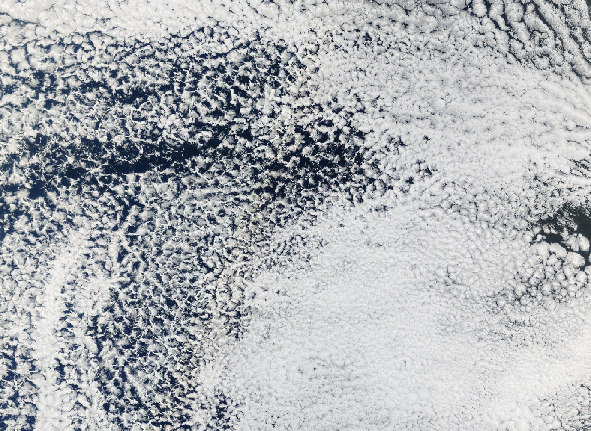
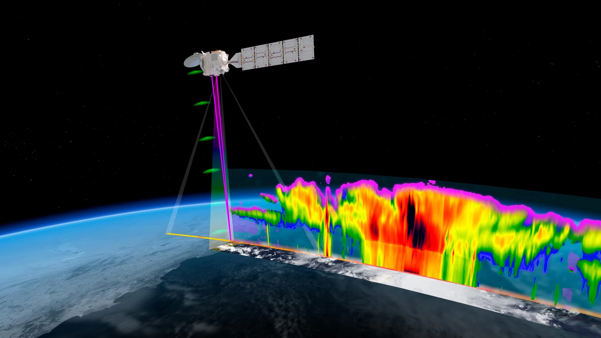

## Mesoscale organization of marine stratocumulus

:::: {.columns}

::: {.column width="60%"}
Marine stratocumulus clouds cover extensive areas of the subtropical oceans and strongly influence Earth's radiation balance. My current work investigates their mesoscale organization, including transitions between closed- and open-cell cloud structures. I combine EarthCARE observations with geostationary satellite imagery to connect horizontal cloud patterns with their vertical structure and to track how cloud systems evolve over time.

This work includes the use of convolutional neural networks for cloud-pattern classification and the analysis of physical mechanisms associated with structural transitions, particularly the role of precipitation.
:::

::: {.column width="40%"}
{fig-align="center" width="100%"}
:::
::::

## EarthCARE and multi-instrument satellite observations

:::: {.columns}
::: {.column width="40%"}
{fig-align="center" width="100%"}
:::

::: {.column width="60%"}
A key element of my research is the combination of complementary satellite measurements. EarthCARE brings together active radar and lidar observations with passive imaging and radiative measurements, enabling cloud systems to be studied in three dimensions. I use these observations together with geostationary imagery to relate detailed vertical cloud properties to their broader spatial organization and temporal development.

I am also exploring causal approaches to distinguish aerosol effects on stratocumulus clouds from meteorological and other confounding influences.
:::
::::

## Cloud thermodynamic phase

During my doctoral research at the German Aerospace Center (DLR), I developed methods to retrieve cloud thermodynamic phase from satellite observations. This included a Bayesian cloud-top phase retrieval for the SEVIRI instrument aboard Meteosat Second Generation, trained and evaluated using combined lidar and radar observations from polar-orbiting satellites.

My work also used radiative transfer calculations to examine how satellite brightness temperatures and their differences respond to cloud phase and related cloud properties. The aim was both to improve retrieval methods and to understand their physical sensitivities and limitations.

## Airborne research and interdisciplinary work

I contributed to the operation of in-situ instruments, weather briefings, and flight planning during the CIRRUS-HL, HALO-(AC)³, and SENS4ICE research campaigns. These activities provided experience at the interface of satellite remote sensing, airborne observations, and campaign operations.

Earlier in my career, I worked on active matter and game theory, combining analytical methods with numerical modelling. This background continues to inform my interest in complex systems, pattern formation, and quantitative approaches to environmental research.

## Research interests

- Satellite remote sensing of clouds
- Marine stratocumulus organization and transitions
- Aerosol–cloud-precipitation interactions
- Cloud thermodynamic phase
- Active and passive multi-sensor observations
- Machine learning for Earth observation
- Statistical and causal analysis
- Radiative transfer
- Science communication and interdisciplinary collaboration
